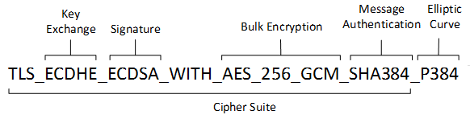

# TLS (Transport Layer Security)

It protects data being sent between client ↔ server

Think of TLS as:
“Secure wrapper around TCP”

It provides:
✔ Authentication
✔ Confidentiality
✔ Integrity
✔ Optional client authentication (mTLS)

TLS protocol has these stages:

## Phase 1 — Handshake

TLS Handshake ensures:

- Agree on security parameters
- Exchange keys
- Authenticate server (and optionally client)

This includes:

1. ClientHello

   - Client sends: supported TLS versions, cipher suites, random nonce.

     `Cipher Suites: A cipher suite is a set of algorithms that help secure a network connection`
     

2. ServerHello

   - Server picks: TLS version, cipher suite, its random nonce.

3. Certificate

   - Server sends X.509 certificate (used to authenticate the server).

4. Key Exchange

   - Usually ECDHE (Ephemeral Diffie-Hellman) to establish shared secret.

5. Finished Messages
   - Both sides prove they derived the same keys.

## Phase 2 — Application Data

TLS Record ensures:

- Confidentiality → encrypted
- Integrity → MAC / AEAD
- Anti-replay → sequence numbers

Now communication uses:

- Symmetric encryption (AES/GCM)
- MAC (Message Authentication Codes)
- Record Protocol to break data into blocks

## TLS Record Protocol

Record Protocol is responsible for:

- Fragmentation
- Compression (rare now)
- Encryption
- MAC
- Delivery

It wraps all messages into “TLS Records”.

## TLS Session Resumption

TLS is slow because handshake is expensive.

So TLS supports:

- Session IDs
- TLS Tickets (Session Tickets)

This is called abbreviated handshake.

Benefits: Faster, Less CPU, Lower latency

