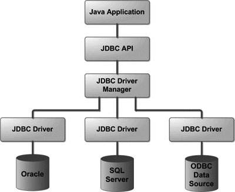

# JDBC (Java Database Connectivity)

JDBC is an API that helps applications to communicate with databases, it allows Java programs to connect to a database,
run queries, retrieve, and manipulate data.

## Why Not Use SQL Directly in Java?

* **Java is a general-purpose programming language** — it doesn't support SQL natively.
* **JDBC acts as a bridge** between Java code and SQL-based database systems.
* It provides a **standardized way** to communicate with various relational databases (e.g., MySQL, Oracle, PostgreSQL,
  etc.).

> 🔄 JDBC bridges the gap:
> **Java Code** ⇄ **JDBC API** ⇄ **Database Driver** ⇄ **SQL Engine**

## JDBC Solves:

- Platform independence for DB connectivity
- Reusable, portable code
- Consistent and standardized approach to interact with multiple types of databases



## 🔧 Key Components of JDBC Architecture

### 1. **Application Layer**

A Java application that initiates communication with the database.

### 2. **JDBC API**

Provides core interfaces and classes for performing database operations.

#### Important Interfaces:

| Interface                                               | Purpose                                                      |
|---------------------------------------------------------|--------------------------------------------------------------|
| `Connection`                                            | Establishes a connection with the database                   |
| `Statement` / `PreparedStatement` / `CallableStatement` | Executes SQL queries and updates                             |
| `ResultSet`                                             | Represents the result of a query                             |
| `RowSet`                                                | Advanced version of ResultSet, often scrollable/disconnected |
| `Driver`                                                | Loads the database driver                                    |

#### Key Classes:

| Class           | Purpose                                   |
|-----------------|-------------------------------------------|
| `DriverManager` | Manages database drivers and connections  |
| `Types`         | Defines SQL data types as Java constants  |
| `Blob` / `Clob` | Represents large binary or character data |

### 3. **JDBC Drivers**

* These are vendor-specific implementations that handle the actual communication with the database.
* JDBC API interacts with these drivers internally to send SQL commands and receive results.

---

### 🔁 Summary

| Layer            | Description                                           |
|------------------|-------------------------------------------------------|
| Java Application | Sends SQL queries via JDBC                            |
| JDBC API         | Translates Java calls into DB-understandable commands |
| JDBC Driver      | Connects to and interacts with the actual database    |
| Database         | Executes SQL queries and returns data                 |

---

The JDBC architecture consists of two-tier and three-tier processing models to access a database. They are as described
below:

1. Two-Tier Architecture

- A Java Application communicates directly with the database using a JDBC driver.
- It sends queries to the database and then the result is sent back to the application.
- Example, A desktop Java application connecting directly to a MySQL database using JDBC.

Structure:

Client Application (Java) -> JDBC Driver -> Database

2. Three-Tier Architecture

- In this, user queries are sent to a middle-tier services, which interacts with the database. The database results are
  processed by the middle tier and then sent back to the user.

Example: A web application where servlets or Spring controllers handle client requests and access the database using
JDBC.
Structure:

Client Application -> Application Server -> JDBC Driver -> Database

# JDBC Components

Absolutely! Let's go through **JDBC Components**, **JDBC APIs**, **JDBC DriverManager**, **JDBC Test Suite**, and **JDBC
Drivers** in a clean, structured, and beginner-friendly way.

## 🔹 JDBC Components

JDBC (Java Database Connectivity) consists of several components that work together to connect and interact with
relational databases.

### ✅ Core JDBC Components:

| Component             | Description                                                                        |
|-----------------------|------------------------------------------------------------------------------------|
| **Driver**            | Interface implemented by database vendors to provide DB-specific connection logic. |
| **Connection**        | Represents a session between Java app and DB. Used to send SQL statements.         |
| **Statement**         | Interface used to execute SQL queries (static SQL).                                |
| **PreparedStatement** | Precompiled version of `Statement` for dynamic SQL (safer and faster).             |
| **CallableStatement** | Used to call stored procedures from the database.                                  |
| **ResultSet**         | Stores data retrieved from the database after query execution.                     |
| **DriverManager**     | Manages and loads JDBC drivers. Helps establish a connection.                      |

## 🔹 JDBC APIs

JDBC provides **APIs (Application Programming Interfaces)** in the form of **interfaces and classes** inside the
`java.sql` and `javax.sql` packages.

### ✳️ Key JDBC Interfaces:

| Interface           | Purpose                                         |
|---------------------|-------------------------------------------------|
| `Driver`            | Loads and registers DB drivers                  |
| `Connection`        | Establishes connection with DB                  |
| `Statement`         | Executes SQL queries                            |
| `PreparedStatement` | Executes parameterized queries                  |
| `CallableStatement` | Calls stored procedures                         |
| `ResultSet`         | Represents query result data                    |
| `ResultSetMetaData` | Info about data inside `ResultSet`              |
| `DatabaseMetaData`  | Info about DB structure (tables, columns, etc.) |

### 📘 Key JDBC Classes:

| Class                       | Purpose                                 |
|-----------------------------|-----------------------------------------|
| `DriverManager`             | Gets DB connections and manages drivers |
| `Types`                     | Defines SQL data type constants         |
| `Date`, `Time`, `Timestamp` | Handle date/time values                 |
| `Blob`, `Clob`              | Store large binary/character data       |

## 🔹 JDBC DriverManager

`DriverManager` is a utility class provided by JDBC to manage a list of database drivers and establish connections.

### ✅ Role of DriverManager:

* Keeps track of registered JDBC drivers
* Chooses the right driver based on the DB URL
* Establishes connection using:

  ```java
  Connection con = DriverManager.getConnection(DB_URL, USER, PASSWORD);
  ```

### 🔁 Internal Flow:

1. You load/register driver (or it happens automatically in JDBC 4+).
2. Call `getConnection()`.
3. `DriverManager` checks which driver can handle the given URL.
4. That driver is used to create a `Connection` object.

## 🔹 JDBC Test Suite

The **JDBC Test Suite** is a set of test cases provided by Oracle to validate the JDBC driver’s compliance with the JDBC
API specification.

### ✅ Purpose:

* Ensures that a JDBC driver behaves correctly and fully supports JDBC features.
* Used by driver developers to test their implementations.

**Note:** As an application developer, you rarely interact with this. It’s mostly for driver vendors.

## 🔹 JDBC Drivers

JDBC drivers are **implementations of the JDBC API** that translate Java calls into DB-specific calls.

### ✅ Four Types of JDBC Drivers:

| Type       | Name                    | Description                                                                | Example                                       |
|------------|-------------------------|----------------------------------------------------------------------------|-----------------------------------------------|
| **Type 1** | JDBC-ODBC Bridge Driver | Translates JDBC calls to ODBC calls (Deprecated)                           | `sun.jdbc.odbc.JdbcOdbcDriver`                |
| **Type 2** | Native-API Driver       | Uses native DB libraries (DLL/.so)                                         | Oracle OCI                                    |
| **Type 3** | Network Protocol Driver | Sends JDBC calls to a middleware server that then communicates with the DB | Middleware (e.g., WebLogic)                   |
| **Type 4** | Thin Driver / Pure Java | Fully written in Java, communicates directly with DB over network          | `com.mysql.cj.jdbc.Driver`, PostgreSQL driver |

### ✅ Preferred Driver:

**Type 4 Driver** is most commonly used today because:

* No native libraries required
* Platform independent
* Easy to deploy and maintain
